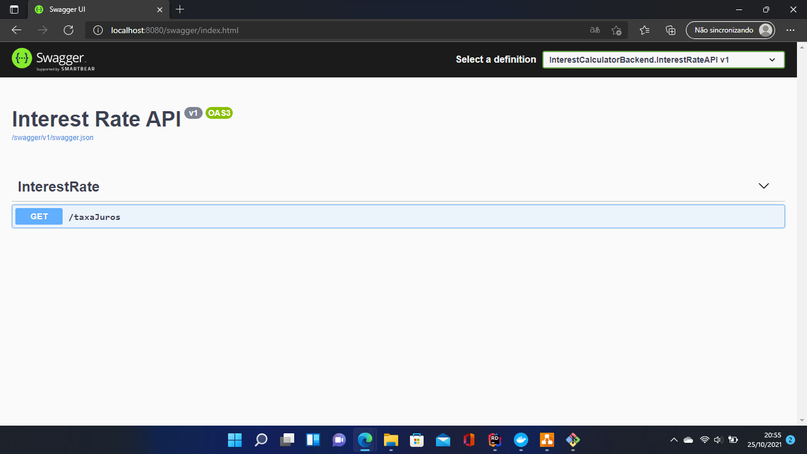

# InterestCalculatorBackend
System for calculating compound interest

[](https://circleci.com/gh/danielbarbor/InterestCalculatorBackend)

## Description

This repository is part of a technical challenge.
The project consists of two APIs, developed in C#, which work as a system for calculating compound interest.

The first API returns a fixed interest rate of 1%, through the endpoint "/taxaJuros".

The second and main API, returns the result of the compound interest calculation. It does an in-memory calculation of compound interest.

result =
initial value * (1 + interest rate) ^ time

The result is displayed through the endpoint "/calculajuros", having parameters in the url, for example: "/calculajuros?valorinicial=1000&meses=12".

The number representation format follows the culture and standard currently used in Brazil.
For example: 105,10

Another function of the second API is to return the url where the source code is located. This function is available in the endpoint /showmethecode

## Architecture definition

The main concern in defining the architecture was to follow the concepts presented by both TDD and DDD. Another concern was to allow a scalable and maintenance-friendly architecture. There is an architecture diagram presented below, after all, an image facilitates the explanation.


### InterestCalculatorBackend.Core

This project represents the core, or application domain, and contains domain entities, and business rules.

### InterestCalculatorBackend.Application

It contains services that are not directly linked to the domain, but that are necessary to fulfill its purpose. Contains services, validations and DTOs, isolating the domain.

### InterestCalculatorBackend.InterestRateClient

This is a module responsible for consulting a second API that only aims to inform the interest rate. It is an API client project that interacts with the application layer.

### InterestCalculatorBackend.WebApi

This module is responsible for exposing the application to the outside world, through a web api.

### InterestCalculatorBackend.InterestRateAPI

This is a simple API, which just returns a fixed interest rate in code. It works as a service completely decoupled from the main application, but there's not much to say about its architecture.

_______________________________________

When the infrastructure is assembled using docker-compose, in theory it works as follows:


## Running the application

To run the application, it is necessary to have the docker and docker-compose software installed on your machine, or infrastructure.

[Download Docker](https://www.docker.com/products/docker-desktop)

[Download Docker Compose](https://docs.docker.com/compose/install/)

Now, to build the application infrastructure, open a terminal inside the 'src' folder of this repository, and run the command below:
```
~$ docker-compose up 
```
This command will create a network and two containers, creating the application infrastructure and communication. The first API will be listening on port 8080, and will be responsible for returning the interest rate. It is possible to access the documentation and test this API through the swagger via the url http://localhost:8080/swagger/, and the page must show something like the image below:



The second but main API is responsible for performing the compound interest calculation and returning a result. It is also responsible for returning the url where the source code of this project is located. It is possible to access the documentation and test this API through the swagger via the url http://localhost:5000/swagger/, and the page must show something like the image below:


## Running automated tests

By default, this repository uses CircleCI for continuous integration, always running all automated tests and performing the application build process. Efforts were made in applying the TDD, and carrying out full test coverage.


To run the tests, access the src folder and run the command below:

```
~$ dotnet test
```
Or use an IDE of your own, such as Rider or Visual Studio.

## Resources used in this project

* .NET 5.0
* ASP.NET
* C#
* Asynchronous Programming
* OOP
* DDD
* TDD
* SOLID
* Dependency Injection
* Restfull
* Refit
* FluentValidator
* Docker
* Docker Compose
* Git
* xUnit (automated testing)
* Moq (automated testing)
* WireMock.Net (automated testing)
* Microsoft.AspNetCore.Mvc.Testing (automated testing)
* Continuous Integration with CircleCI

## IDE
This project was developed using:

* JetBrains Rider 2021.2.2 on Windows 11


